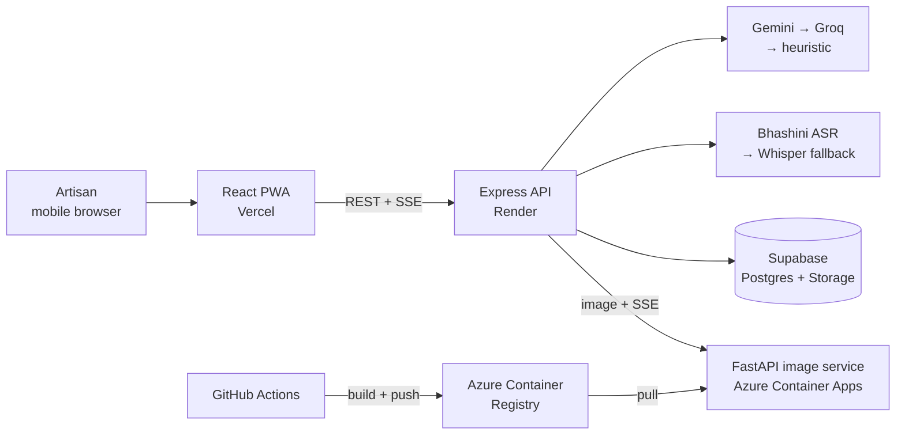

# ShilpSaathi · शिल्पसाथी

> **Your Craft. Your Story. Your Market.**

[](https://github.com/HarshitPandey-2021/shilpsaathi/actions/workflows/deploy-ai.yml)


**Live app:** https://shilpsaathi.vercel.app

ShilpSaathi is a mobile-first Progressive Web App that lets an artisan turn one
photograph and a spoken description into a marketplace-ready product listing — without
needing to be a photographer, copywriter, translator or pricing expert.

The artisan photographs a product and describes it aloud in their own language. The
system removes the background and corrects the photograph, transcribes the speech,
generates a structured bilingual (Hindi / English) catalogue entry, and proposes a
transparent, cost-based price.

Built for **Smart India Hackathon 2026**, Problem Statement **26090** — Ministry of Social
Justice and Empowerment, theme *Heritage & Culture*.

---

## Contents

- [How it works](#how-it-works)
- [Features](#features)
- [Architecture](#architecture)
- [The AI pipelines](#the-ai-pipelines)
- [Performance](#performance)
- [Tech stack](#tech-stack)
- [Project structure](#project-structure)
- [Getting started](#getting-started)
- [Environment variables](#environment-variables)
- [Deployment](#deployment)
- [API reference](#api-reference)
- [Database schema](#database-schema)
- [Troubleshooting](#troubleshooting)
- [Security and known limitations](#security-and-known-limitations)
- [Testing status](#testing-status)
- [Roadmap](#roadmap)
- [Team](#team)
- [Acknowledgements and licences](#acknowledgements-and-licences)

---

## How it works

```text
Photograph ─▶ AI image studio ─▶ Speak a description ─▶ Speech-to-text
          ─▶ Bilingual catalogue ─▶ Fair price ─▶ Review ─▶ Publish ─▶ Share
```

1. **Capture.** The artisan takes or uploads a photo on their phone.
2. **Enhance.** A nine-stage image pipeline removes the background, measures the photo
   and corrects only what it needs, and composes a clean 1080×1080 product image.
   Progress streams live to the screen.
3. **Describe.** The artisan speaks naturally — *"यह हाथ से बना मिट्टी का फूलदान है, पाँच घंटे लगे"*.
4. **Catalogue.** Speech is transcribed and, together with the enhanced photo, turned
   into a structured listing: title, category, material, colour, craft technique,
   keywords, and descriptions in Hindi and English.
5. **Price.** A cost-plus calculation from materials, labour hours and skill level,
   with every component shown.
6. **Publish and share.** The listing is saved and shared through the phone's native
   share sheet.

---

## Features

| Feature | Status | Notes |
|---|---|---|
| Guided product-creation flow | ✅ Working | One product per session, held in React context until publish |
| Photo capture / upload | ✅ Working | JPEG, PNG, WebP, GIF up to 25 MB |
| AI image enhancement | ✅ Working | Background removal, adaptive correction, 1080×1080 canvas; streamed progress |
| Adaptive photo correction | ✅ Working | Per-image measurement; applies only the corrections each photo needs |
| Colour detection from pixels | ✅ Working | Measured from the isolated product, not inferred from text |
| Voice recording | ✅ Working | 16 kHz mono WAV in the browser, live level meter |
| Speech-to-text | ✅ Working | Bhashini (MeitY) primary, Whisper fallback |
| AI catalogue generation | ✅ Working | Multimodal LLM (photo + transcript), Gemini → Groq → heuristic fallback |
| Hindi / English content | ✅ Working | Structured output in both languages |
| Pricing assistant | ✅ Working | Cost + labour + 12% overhead + 25% margin, suggested range |
| Artisan identity by phone | ✅ Working | Mobile-number-first, E.164 normalised |
| Publish to database + storage | ✅ Working | Product row in Postgres, enhanced image in object storage |
| Native share | ✅ Working | Web Share API with clipboard fallback |
| CI build of the AI service | ✅ Working | GitHub Actions → Azure Container Registry |
| UI in six languages | 🟡 Partial | Hindi, English, Bengali, Tamil, Telugu, Marathi UI; catalogue output is Hindi/English |
| Skill-tier pricing in UI | 🟡 Partial | Tiers (₹120 / ₹180 / ₹260 per hour) exist in the service, not yet exposed as controls |
| Final review editing | 🟡 Partial | Catalogue editable before pricing; review screen is read-only |
| Public listing page / link | ⏳ Planned | — |
| WhatsApp and UPI | ⏳ Planned | — |
| Authentication | ⏳ Planned | — |
| Offline mode | ⏳ Planned | PWA shell only; no offline product workflow |

---

## Architecture



| Layer | Responsibility | Hosting |
|---|---|---|
| **Frontend** | Guided flow, camera and microphone, WAV encoding, local state | Vercel |
| **Backend** | Routing, validation, voice and LLM orchestration, pricing, persistence, storage uploads, proxying the image service | Render |
| **Image service** | Stateless image processing: background removal, correction, composition, colour detection | Azure Container Apps |
| **Data** | Artisans, products, processing logs; product images | Supabase |

The frontend never calls the image service directly — the Express API is the only
bridge. The image service is stateless: it takes an image and returns an image.

---

## The AI pipelines

### Image pipeline — `ai-service/processor.py`

Nine stages, each timed and logged, streamed to the client as Server-Sent Events.

| # | Stage | What it does |
|---|---|---|
| 1 | **Resize** | Caps the longest edge at 768 px for processing |
| 2 | **Quality analysis** | Resolution, blur (Laplacian variance), brightness |
| 3 | **Background removal** | `rembg` with the **U²-Net-p** (`u2netp`) ONNX model |
| 4 | **Edge refinement** | Cleans the alpha mask |
| 5 | **Crop** | Tight crop to the product's alpha bounds |
| 6 | **Product quality analysis** | Re-measures the isolated product |
| 7 | **Upscale decision** | Lanczos enlargement only when the crop is too small |
| 8 | **Adaptive lighting** | Measured, per-image correction (below) |
| 9 | **Canvas** | Centres the product on a 1080×1080 white canvas |

It then detects the product's **dominant colour** from the median of opaque pixels
(alpha > 200), matched to the nearest named colour with a confidence score.

**SSE stages:** `starting`, `loaded`, `resizing`, `quality`, `background`, `edges`,
`cropping`, `product_quality`, `upscaling`, `lighting`, `canvas`, `enhancing`, `stored`.

#### Adaptive correction — `ai-service/adaptive.py`

Most pipelines apply the same filter to every photo. This one measures each image
first — exposure percentiles (p1 to p99), standard deviation, Laplacian sharpness and a
noise estimate — and applies only what that image needs:

| Correction | Applied when |
|---|---|
| Bilateral denoise | Measured noise is high |
| CLAHE on the LAB L-channel + gamma lift | The image is underexposed — but not when the object is genuinely dark |
| Highlight recovery | Highlights are blown |
| Unsharp mask | The image is soft |

Real production log output, four different photos:

```text
applied: sharpen(0.6)
applied: lift(gamma=0.91), sharpen(0.35)
applied: denoise(6.0), highlight-recover
applied: sharpen(0.35)
```

### Speech pipeline

The browser records **16 kHz mono WAV** (`src/utils/wavEncoder.js`) — the format
Bhashini requires — with a live input level meter driven by a Web Audio `AnalyserNode`.
The server transcribes it in order of preference:

1. **Bhashini** (MeitY ULCA / Dhruva) — Indian-language ASR
2. **Whisper** (`whisper-large-v3` via Groq) — fallback
3. The browser's Web Speech API transcript — last resort

### Catalogue pipeline — `server/src/services/voiceService.js`, `llmService.js`

The transcript **and the enhanced product photo** are sent to a multimodal language
model, which returns a structured catalogue entry. Providers are tried in order, and
every failure is classified (`auth/expired_token`, `quota_exceeded`, `timeout`,
`provider_error`) and logged without exposing keys:

```text
Gemini (image + text) ──fail──▶ Groq (vision model when an image is present)
                      ──fail──▶ Local heuristic extractor
```

The prompt instructs the model to return `null` for any field the artisan did not
state, rather than inventing one. Output from every provider is normalised through the
same schema.

### Pricing — `server/src/services/pricingService.js`

```text
price = materials + (labour hours × skill rate) + 12% overhead + 25% artisan margin
```

It returns a suggested price and range with every component visible, so the artisan
can understand and defend it to a buyer. The frontend falls back to a local calculation
if the API is unreachable.

---

## Performance

Measured in production on Azure Container Apps, from the service's own per-stage timers.

| Scenario | Background removal | Total pipeline |
|---|---|---|
| **Warm** — 1920×1080 input | 0.31 s | **0.46 s** |
| **Warm** — 192×192 input | 0.47 s | **0.55 s** |
| **Cold** — first request after scale-from-zero | 38.85 s | 38.98 s |

Every stage other than background removal completes in hundredths of a second.

The cold-start cost is almost entirely **ONNX model initialisation**. The model session
is created once per process (`functools.lru_cache`) and reused, so only the first
request on a fresh container pays it. See [Deployment → Cold starts](#cold-starts).

The cold measurement was taken at 1 vCPU; the service now runs at 2 vCPU.

---

## Tech stack

| Area | Technology |
|---|---|
| Frontend | React 19, Vite 8, Tailwind CSS 3, `vite-plugin-pwa`, `lucide-react` |
| Backend | Node.js 20, Express 5, Supabase JS, Multer, CORS, dotenv |
| Image service | Python 3.11, FastAPI, Uvicorn, ONNX Runtime, `rembg`, OpenCV (headless), Pillow, NumPy, SciPy |
| Data and storage | Supabase — PostgreSQL + object storage |
| AI services | Bhashini (MeitY), Google Gemini, Groq (LLM + Whisper) |
| Infrastructure | Vercel, Render, Azure Container Apps, Azure Container Registry |
| CI | GitHub Actions |

---

## Project structure

```text
shilpsaathi/
├── .github/
│   └── workflows/
│       └── deploy-ai.yml          # Builds and pushes the image-service container
├── src/                           # React PWA
│   ├── screens/                   # One file per step of the guided flow
│   ├── components/                # Shared UI, including ui/Sheet.jsx (portal modal)
│   ├── context/                   # CraftContext — product state for the session
│   └── utils/
│       └── wavEncoder.js          # 16 kHz mono WAV recorder
├── server/                        # Express API
│   ├── index.js
│   └── src/
│       ├── app.js
│       ├── config/
│       ├── routes/
│       ├── controllers/
│       ├── services/
│       │   ├── voiceService.js    # ASR + catalogue extraction
│       │   ├── llmService.js      # Gemini → Groq fallback chain
│       │   ├── pricingService.js
│       │   └── aiServiceRunner.js # Local spawn vs. remote image service
│       └── db/
│           └── schema.sql
├── ai-service/                    # Stateless image service
│   ├── main.py                    # FastAPI app: /, /enhance, /enhance/stream
│   ├── processor.py               # The nine-stage pipeline
│   ├── adaptive.py                # Measured, per-image correction
│   ├── background_remover.py      # rembg / u2netp session
│   ├── quality.py
│   ├── upscaler.py
│   ├── benchmark_pipeline.py
│   ├── requirements.txt
│   ├── Dockerfile
│   ├── .dockerignore
│   └── AI-MODELS.md
├── public/
├── docker-compose.yml
├── Dockerfile.client
├── vite.config.js
├── tailwind.config.js             # Design tokens: palette, type scale, motion
└── package.json
```

---

## Getting started

### Prerequisites

- Node.js 20+ and npm
- Python 3.11
- A Supabase project with a `product-images` storage bucket

### 1. Install

```bash
npm install
cd server && npm install && cd ..
```

```bash
cd ai-service
python -m venv venv
# Windows:  .\venv\Scripts\Activate.ps1
# macOS/Linux:  source venv/bin/activate
pip install -r requirements.txt
cd ..
```

> Keep the virtualenv **inside `ai-service/` only for local development**. It is
> excluded from container builds by `.dockerignore`.

### 2. Database

Run `server/src/db/schema.sql` in the Supabase SQL editor, and create a storage bucket
named `product-images`.

### 3. Configure

Copy `.env.example` to `.env` in the root and in `server/`, and fill in the values
listed under [Environment variables](#environment-variables).

### 4. Run

```bash
npm run server:dev    # Express on :5000 — also starts the local image service on :8000
npm run dev           # Vite on :5173
```

If `AI_IMAGE_SERVICE_URL` points to a remote service, the backend connects to it instead
of spawning a local Python process.

To run the image service on its own:

```bash
cd ai-service
uvicorn main:app --host 127.0.0.1 --port 8000
```

### Scripts

| Command | Purpose |
|---|---|
| `npm run dev` | Start the Vite dev server |
| `npm run build` | Build the frontend |
| `npm run preview` | Preview the production build |
| `npm run lint` | Run ESLint |
| `npm run server` | Start the API |
| `npm run server:dev` | Start the API in watch mode |

### Docker

```bash
docker compose up --build
```

Runs the client on `:3000`, the API on `:5000` and the image service on `:8000`.

---

## Environment variables

### Frontend (Vercel)

| Variable | Required | Purpose |
|---|---|---|
| `VITE_API_URL` | ✅ | Backend base URL. `/api` is appended automatically if missing |

> Vite embeds these **at build time**. After changing one, you must **redeploy** — the
> change does nothing until the next build.

### Backend (Render)

| Variable | Required | Purpose |
|---|---|---|
| `PORT` | | Default `5000` |
| `NODE_ENV` | | `production` in deployment |
| `CORS_ORIGIN` | ✅ | The exact frontend origin, e.g. `https://shilpsaathi.vercel.app` |
| `SUPABASE_URL` | ✅ | Supabase project URL |
| `SUPABASE_SERVICE_ROLE_KEY` | ✅ | Server-side key — never expose to the client |
| `SUPABASE_ANON_KEY` | | |
| `SUPABASE_STORAGE_BUCKET` | | Default `product-images` |
| `AI_IMAGE_SERVICE_URL` | ✅ | Base URL of the image service |
| `AI_ENHANCE_TIMEOUT` | | Milliseconds. Must exceed the cold-start time — `180000` recommended |
| `BHASHINI_USER_ID` | | Enables Bhashini ASR |
| `BHASHINI_API_KEY` | | |
| `BHASHINI_INFERENCE_API_KEY` | | |
| `BHASHINI_PIPELINE_ID` | | |
| `GEMINI_API_KEY` | | Primary LLM provider |
| `GEMINI_MODEL` | | `gemini-2.5-flash` |
| `GROQ_API_KEY` | | Secondary LLM provider and Whisper fallback. Keys start with `gsk_` |
| `GROQ_MODEL` | | Optional; the service has built-in fallback candidates |

Every AI provider is optional: if a key is missing or invalid, that provider is skipped
and the next one in the chain is used. With no AI keys at all, the app still works using
the local heuristic extractor — at lower quality.

> **Check the values, not just the names.** A retired `GEMINI_MODEL` or an empty
> `GROQ_API_KEY` fails silently into the heuristic fallback. Look for
> `✅ Structured catalog successfully generated by …` in the backend logs to confirm the
> LLM path is live.

### Image service (set in the Dockerfile)

| Variable | Value | Purpose |
|---|---|---|
| `PORT` | `8000` | |
| `U2NET_HOME` | `/app/.rembg` | Model cache location — the model is downloaded **at build time** so it is baked into the image |

---

## Deployment

| Component | Platform | Deploys on |
|---|---|---|
| Frontend | Vercel | Push to the configured production branch |
| Backend | Render | Push (auto-deploy) |
| Image service | Azure Container Apps, Consumption plan, Central India | GitHub Actions build + `az containerapp update` |

### Image service: build and release

Azure for Students subscriptions do not allow **ACR Tasks** (in-Azure container builds),
so the image is built by GitHub Actions and pushed to Azure Container Registry.

`.github/workflows/deploy-ai.yml` runs on every push that touches `ai-service/**`. It
requires two repository secrets:

| Secret | Value |
|---|---|
| `ACR_USERNAME` | Registry admin username |
| `ACR_PASSWORD` | From `az acr credential show --name <registry>` |

After a successful build, roll out the new image as a new revision:

```bash
az containerapp update \
  --name ss-ai --resource-group shilpsaathi \
  --image shilpsaathiacr.azurecr.io/ss-ai:latest \
  --revision-suffix $(date +%m%d%H%M)
```

The revision suffix forces a new revision, which guarantees the new image is pulled.
Previous revisions are retained for rollback:

```bash
az containerapp revision list --name ss-ai --resource-group shilpsaathi -o table
```

### Scaling configuration

| Setting | Value | Why |
|---|---|---|
| CPU / memory | 2 vCPU / 4 GiB | The maximum for a single container on the Consumption plan |
| `min-replicas` | `0` | Scales to zero when idle — no charge while unused |
| `max-replicas` | `1` | Caps cost; no runaway scaling |

### Cold starts

With `min-replicas 0`, the container shuts down about five minutes after the last
request. The next request boots it and loads the ONNX model — **about 39 seconds**, once.
Every request after that takes about half a second.

For a demo or evaluation, keep one replica warm, then release it afterwards:

```bash
az containerapp update --name ss-ai --resource-group shilpsaathi --min-replicas 1
# afterwards
az containerapp update --name ss-ai --resource-group shilpsaathi --min-replicas 0
```

Running with `min-replicas 1` permanently consumes the free monthly compute grant in a
few days. Keep it for the hours you need it.

> Opening the service's health URL starts the container but **does not load the model**.
> To warm it fully, process one real image.

### Keeping the backend awake

Render's free tier sleeps after 15 minutes of inactivity (~50 s to wake). An uptime
monitor pings `GET /api/health` every 5 minutes to prevent this.

**Do not** point an uptime monitor at the image service — it would keep the container
running permanently, and bill as active usage.

### Logs

- **Backend:** Render dashboard → service → Logs
- **Image service:** Azure portal → Container App → **Log stream**

> `az containerapp logs show --follow` currently fails with `KeyError: 'eventStreamEndpoint'`,
> a known Azure CLI issue. Use the portal's Log stream instead.

---

## API reference

Base URL: `<backend>/api`. Responses use a shared envelope; `/api/health` has its own shape.

### Health

| Method | Endpoint | Purpose |
|---|---|---|
| GET | `/api/health` | API status and database configuration |

### Products

| Method | Endpoint | Purpose |
|---|---|---|
| GET | `/api/products` | List products; optional `artisan_id` filter |
| POST | `/api/products` | Create a product |
| GET | `/api/products/:id` | Get a product |
| PUT | `/api/products/:id` | Update a product |
| DELETE | `/api/products/:id` | Delete a product |
| GET | `/api/products/:id/listing` | Product with artisan details |
| PATCH | `/api/products/:id/status` | Set `draft`, `published` or `archived` |

### Artisans

| Method | Endpoint | Purpose |
|---|---|---|
| GET | `/api/artisans` | List artisans |
| POST | `/api/artisans` | Create an artisan |
| GET | `/api/artisans/:id` | Get an artisan |
| PUT | `/api/artisans/:id` | Update an artisan |
| DELETE | `/api/artisans/:id` | Delete an artisan |
| POST | `/api/artisans/resolve` | Resolve an artisan by phone, creating one if new |
| POST | `/api/artisans/link-phone` | Attach a phone number to an existing artisan |

### Images

| Method | Endpoint | Purpose |
|---|---|---|
| POST | `/api/upload` | Enhance and store an image. Multipart field `image` |
| POST | `/api/upload/stream` | Same, with SSE stage-by-stage progress. **Used by the frontend** |

### AI

| Method | Endpoint | Purpose |
|---|---|---|
| POST | `/api/process-voice` | Audio or transcript → transcript, catalogue and pricing. Pass `transcribeOnly: true` for transcription alone |
| POST | `/api/calculate-price` | Pricing recommendation |
| POST | `/api/products/:id/transcribe` | Product-scoped transcription |
| POST | `/api/products/:id/generate-catalog` | Product-scoped catalogue extraction |
| POST | `/api/products/:id/pricing` | Product-scoped pricing |

### Image service (internal — called only by the backend)

| Method | Endpoint | Purpose |
|---|---|---|
| GET | `/` | Health check |
| POST | `/enhance` | Process an image. Multipart field `file` |
| POST | `/enhance/stream` | Process with SSE progress |

### Validation and status codes

Inputs are validated for required fields, string lengths, numeric prices, allowed
statuses, keyword arrays, UUIDs and duplicate phone numbers. Uploads are held in memory,
limited to one file, restricted to JPEG / PNG / WebP / GIF, and capped at 25 MB.

| Code | Meaning |
|---|---|
| 200 | Success |
| 201 | Created |
| 400 | Malformed request or invalid upload |
| 403 | Ownership check failed |
| 404 | Not found |
| 413 | Upload exceeds 25 MB |
| 422 | Field-level validation failure |
| 500 | Unexpected server or storage error |
| 503 | Database or image service unavailable |
| 504 | Image enhancement timed out |

---

## Database schema

Defined in `server/src/db/schema.sql`.

| Table | Contents |
|---|---|
| `artisans` | `id`, `name`, unique `phone`, `preferred_language`, `location`, `created_at` |
| `products` | Artisan relation; name, category, material, colour, craft type; Hindi and English descriptions; keywords; original and enhanced image URLs; price fields; status; `created_at` |
| `processing_logs` | Operation status and timestamps per product. *Defined, not yet written to* |

The schema seeds a demo artisan for development. Row-level security statements are
present but commented out.

---

## Troubleshooting

| Symptom | Cause and fix |
|---|---|
| First image takes ~40 s, then fast | Cold start — ONNX model loading. Expected with scale-to-zero; see [Cold starts](#cold-starts) |
| Upload stuck at 0% | Image service is cold, or `AI_ENHANCE_TIMEOUT` is shorter than the cold start. Set it to `180000` |
| Catalogue looks generic or keyword-based | The LLM chain failed and fell back to the heuristic. Check `GEMINI_MODEL` and `GROQ_API_KEY` **values** in the backend logs |
| `Gemini 404 … model not found` | `GEMINI_MODEL` names a retired model. Use `gemini-2.5-flash` |
| `Groq: Key not configured` | `GROQ_API_KEY` is empty |
| `Bhashini … HTTP 500` | Check all four `BHASHINI_*` variables; Whisper takes over as fallback |
| Frontend calls the wrong backend | `VITE_API_URL` changed without a **redeploy** |
| CORS error in the browser | `CORS_ORIGIN` must match the frontend origin exactly — scheme included, no trailing slash |
| Container build hangs uploading | A virtualenv or weights folder is inside the build context. Check `.dockerignore` |
| `pip install` fails on `basicsr` / CUDA packages | `requirements.txt` must list only direct dependencies, never a `pip freeze` dump |
| Missing Supabase storage | Check `SUPABASE_URL`, the service-role key and the `product-images` bucket |

---

## Security and known limitations

**In place:** server-side database access with the service-role key; request and upload
validation; configurable CORS; in-memory uploads; no secrets in container images; API
keys never logged; automatic provider failover.

**Not yet in place — known limitations:**

- **No authentication.** Artisans are identified by phone number without verification.
- **Row-level security** is not enabled in Supabase.
- **No rate limiting** on the API.
- **The image service has public, unauthenticated ingress.** Anyone with its URL could
  consume the compute grant. It should be restricted to the backend.
- **The heuristic fallback fills defaults.** When both LLM providers are unavailable,
  the local extractor substitutes default labour hours and material cost where the
  artisan did not state them.
- **Catalogue output is Hindi and English only**, although the UI supports six languages.
- **The frontend may continue with a local preview** if enhancement fails. Decide whether
  that is acceptable before treating such a listing as publishable.
- **No offline workflow**, checkout, orders, public listing page or WhatsApp integration.

---

## Testing status

There is **no automated test suite yet**. `ai-service/benchmark_pipeline.py` benchmarks
the image pipeline against sample images, and every pipeline stage logs its own timing in
production.

"Working" in this README means the code path is deployed and has been exercised manually
in production. It is not a claim of automated end-to-end coverage.

---

## Roadmap

**Phase 1 — reliability**

- [ ] Visible "waking up" state for image-service cold starts
- [ ] Explicit handling for silent or too-short recordings, HEIC photos, oversized
      uploads, dropped SSE connections and double submission
- [ ] Remove heuristic default values; leave unstated fields empty
- [ ] Expose skill-tier pricing controls
- [ ] Market price range from grounded search, shown as context alongside cost-plus
- [ ] Restrict image-service ingress to the backend
- [ ] Automated tests: image pipeline, API, critical frontend paths
- [ ] Error monitoring and `processing_logs` writes
- [ ] Mobile viewport and bottom-navigation fixes

**Phase 2 — market linkage**

- [ ] Public listing page per product, with Open Graph tags and `Product` structured data
- [ ] WhatsApp sharing and UPI payment link / QR
- [ ] Authentication, artisan sessions and row-level security
- [ ] Buyer-side discovery (B2B)
- [ ] ONDC integration — under evaluation

---

## Team

| Member | Area | Responsibilities |
|---|---|---|
| Shakti | Team lead and presentation | Product vision, pitch narrative, demos |
| Harshit | Frontend and PWA | Screen flows, PWA shell, camera and microphone, API integration |
| Somesh | Backend and database | Express APIs, Supabase, storage, validation |
| Shiva | AI integration | Speech integration, catalogue prompts, image pipeline |
| Piyush | QA and content | Test scenarios, Hindi / English terminology |
| Kamini | Low-literacy UX | Voice-prompt usability testing, field demo data |

---

## Acknowledgements and licences

- **[Bhashini](https://bhashini.gov.in)** — Ministry of Electronics and Information
  Technology, Government of India — Indian-language speech recognition.
- **[rembg](https://github.com/danielgatis/rembg)** — background removal.
- **U²-Net** — Qin, X. et al. (2020), *U²-Net: Going Deeper with Nested U-Structure for
  Salient Object Detection*, Pattern Recognition 106. The `u2netp` weights are
  distributed under the Apache 2.0 licence.
- Google Gemini and Groq for language and Whisper models.

This project was developed for Smart India Hackathon 2026. There is no separate
open-source licence file. Review third-party dependency and model licences — see
`ai-service/AI-MODELS.md` — before any commercial use.
